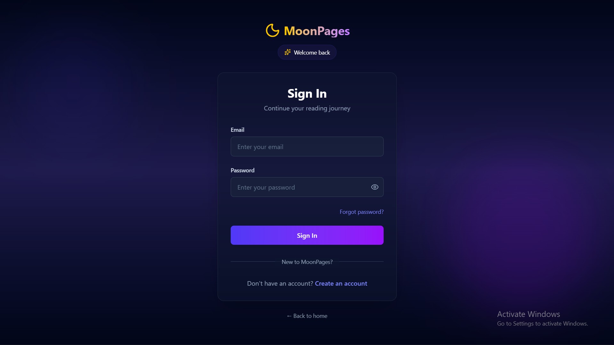
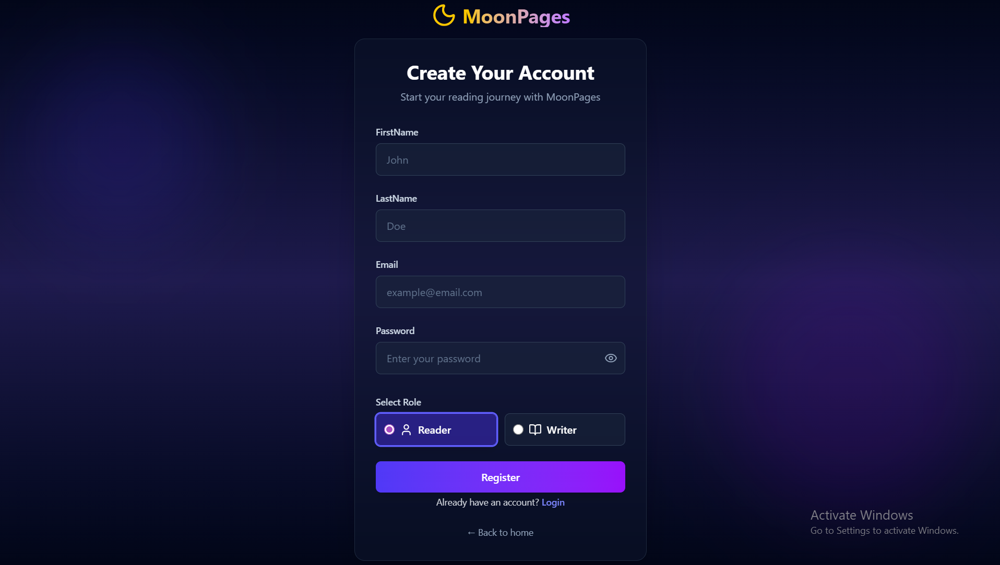
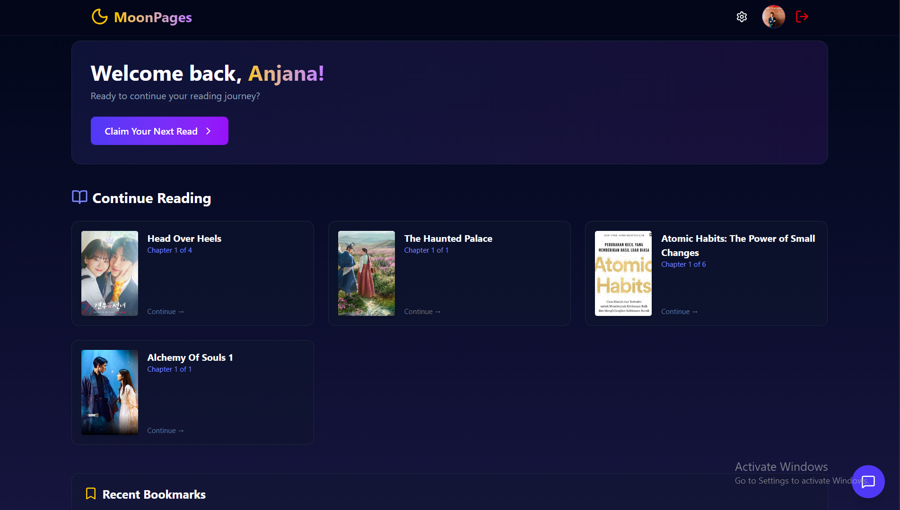
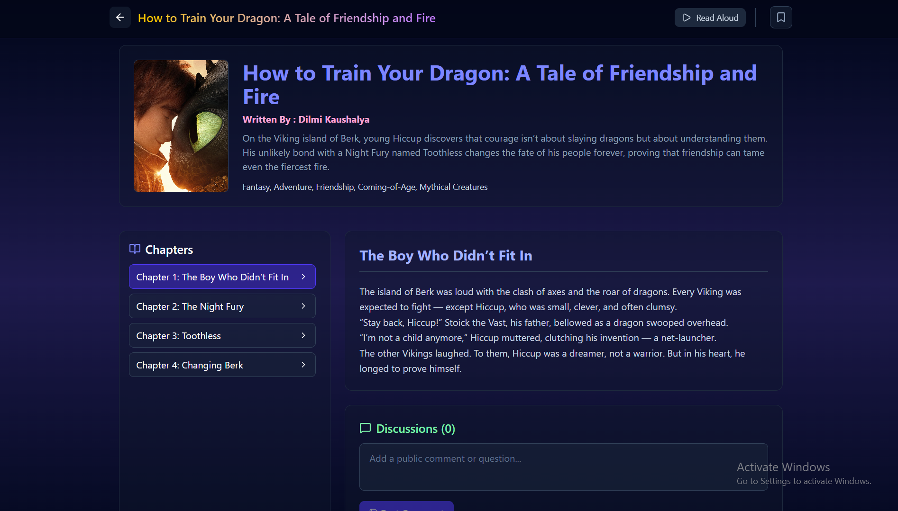
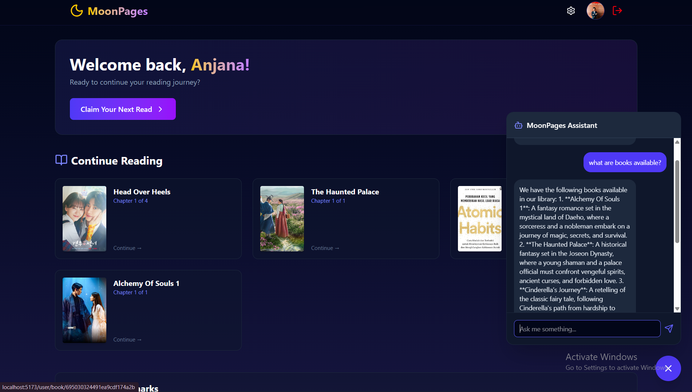
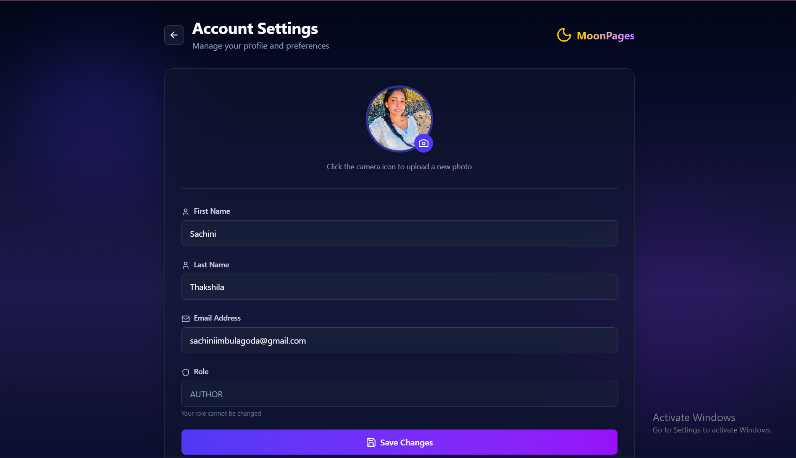
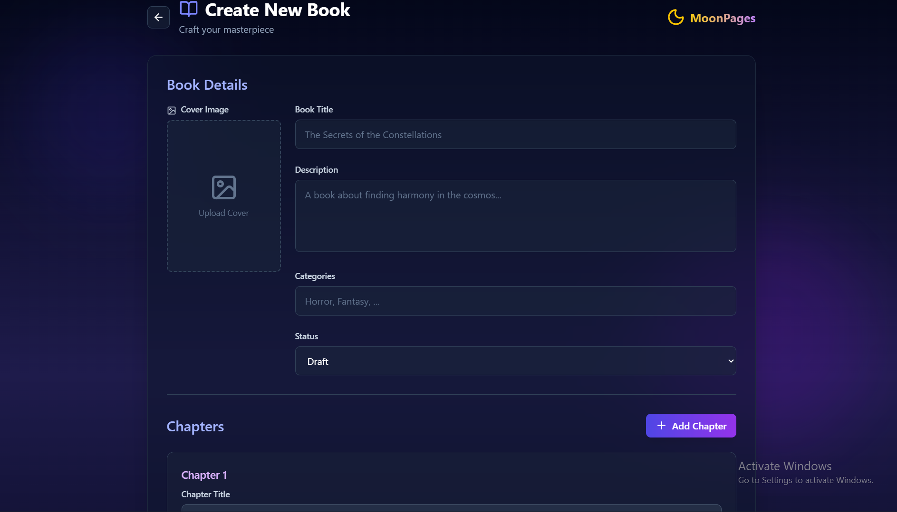
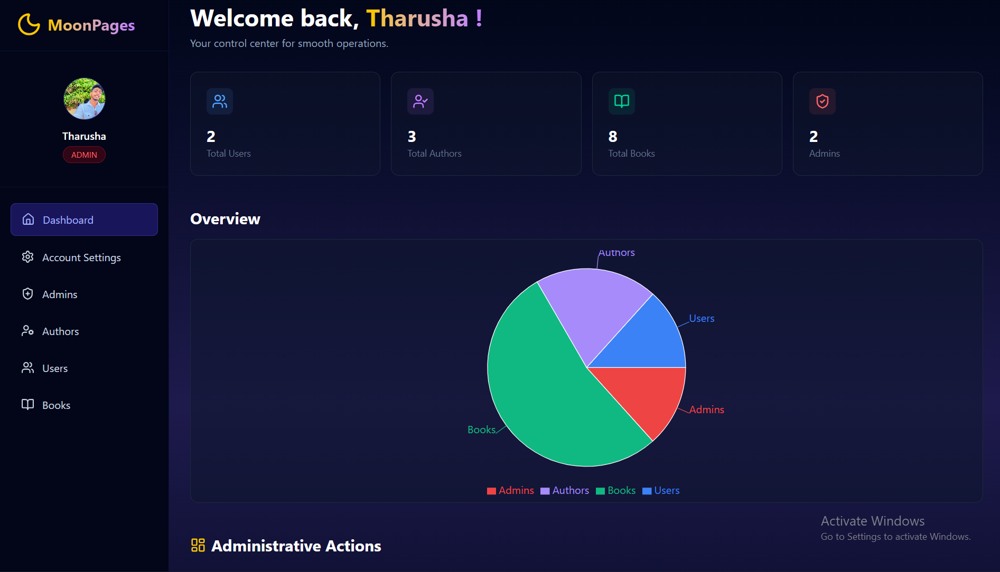
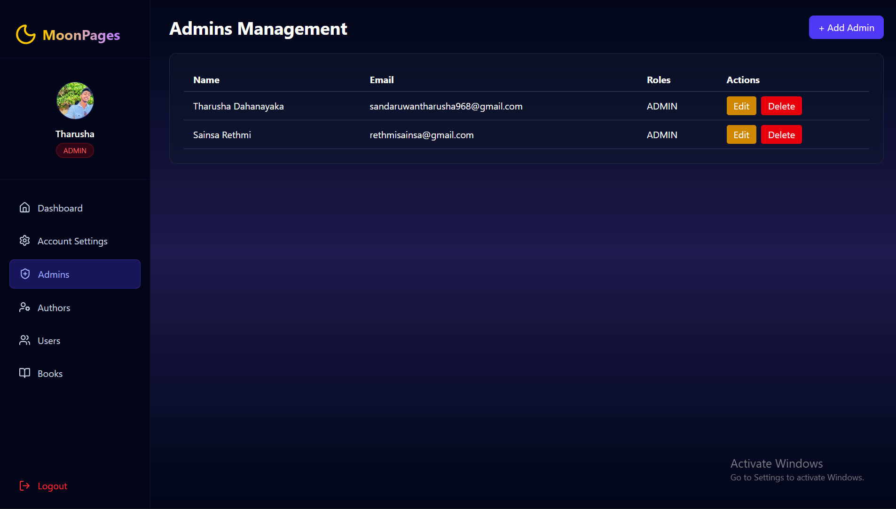

# 🌙 MoonPages: Interactive Online Book Reading Platform

## Project Overview
MoonPages is a full-stack web application that allows users to read books online, track their reading progress, and interact with an AI-powered chatbot for summaries, recommendations, and Q&A. Users can bookmark pages, highlight text, participate in chapter discussions, and enjoy a personalized, interactive reading experience.  

Authors can upload and manage books. Admins can monitor user activity, and maintain the platform. The project demonstrates full-stack proficiency using **MERN + TypeScript** stack, following RAD and agile development principles.

---

## 🖼️ Screenshots

### Homepage & Authentication!

*Clean and welcoming homepage with easy navigation*


*Secure login system with password recovery option*


*Simple registration process for new users*

### Reader Dashboard

*Personalized dashboard with notifications and my bookmarked books*


*Reader can read books chapterwise and also can if want bookmark chapter, listen to the audio of book and add comment for book*


*Reader can search book by book name, author name or book content*


*AI chatbot for book summaries, Q&A, and recommendations*

### Author Dashboard

*Personalized dashboard with notifications and my books*


*User profile management with photo upload capability*


*Author book creation page*

### Author Dashboard

*Personalized dashboard with charts*


*Complete admin management system*

---

## Features

### User Features
- Registration and login (Reader role)
- Forgot passsword and Reset Password(via Gmails)
- Online book reader with pagination and dark mode
- Bookmarking and text highlighting
- Reading progress tracker and dashboard
- AI chatbot for book summaries, Q&A, and recommendations
- Chapter-wise comments
- Search and filter books by genre, author, title, or content
- Responsive UI with Tailwind CSS and React components

### Author Features
- Book upload and management
- Chapter-wise comments
- Role-based authorization

### Admin Features
- Monitoring user activity
- Role-based authorization
- Admin account creation

---

## Technologies Used

### Backend
- React (Functional Components & Hooks)
- TypeScript
- Tailwind CSS
- Redux for global state management

---

## System Architecture

**📁 Folder Structure (Frontend)**

```
front-end/
├── node_modules/
├── public/
├── screenshots/
├── src/
      ├── assets/
      ├── components/
              └──  admin/
      ├── context/
      ├── pages/
              ├── admin/
              ├── author/
              ├── user/
      ├── routes/
      ├── services/
      ├── App.css
      ├── App.tsx
      ├── index.css
      ├── main.tsx
      └── types.ts
├── .env
├── .gitignore
├── eslint.config.js
├── index.html
├── package-lock.json
├── package.json
├── tsconfig.json
├── tsconfig.app.json
├── tsconfig.node.json
├── vite.config.ts
├── vercel.json
└── README.md
```
---

##⚙️ Setup and Installation

1. Clone the repository:
```bash
git clone https://github.com/sachi-thakshi/MoonPages-FE.git
cd MoonPages-FE
```

2. Install dependencies:
```bash
npm install
npm install react-router-dom
npm install axios
```

3. Create .env file:
```env
VITE_API_BASE_URL=http://localhost:5000/api/v1
```

4. Run development server:
```bash
npm run dev
```

5. Build & run production server:
```bash
npm run build
npm start
npm run dev
```

## Deployement
Frontend URL: vercel – https://moon-pages-fe.vercel.app
